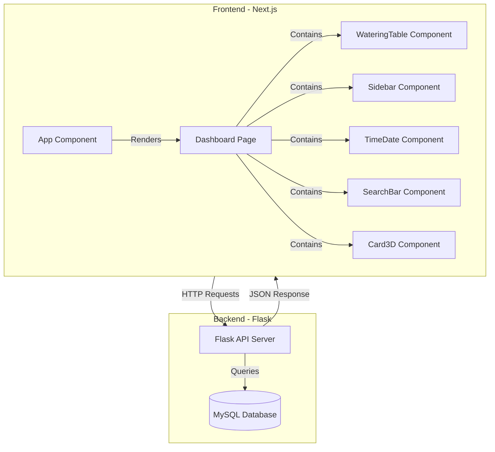
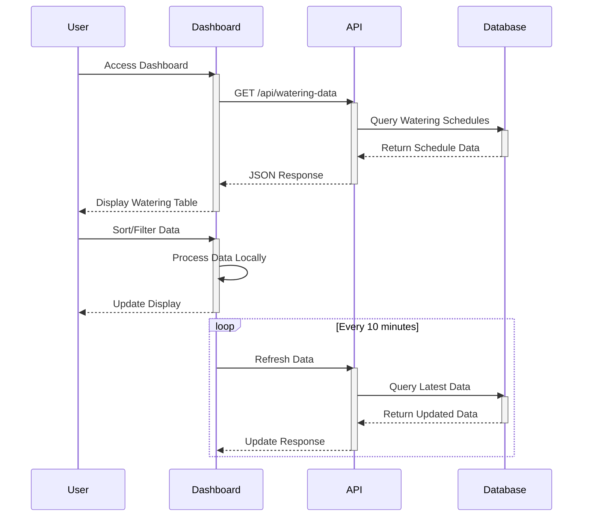

# Plant Watering Dashboard System Documentation

## System Architecture



## Component Hierarchy

```mermaid
classdiagram
    App <|-- Dashboard
    Dashboard *-- WateringTable
    Dashboard *-- Sidebar
    Dashboard *-- TimeDate
    Dashboard *-- SearchBar
    Dashboard *-- Card3D

    class App{
        +render()
    }
    class Dashboard{
        -data: WateringData[]
        -filteredData: WateringData[]
        -loading: boolean
        -error: string
        +fetchData()
        +handleSearch(term: string)
        +render()
    }
    class WateringTable{
        -initialData: WateringData[]
        -sortField: string
        -sortDirection: string
        +handleSort()
        +formatTime()
        +render()
    }
    class TimeDate{
        -time: string
        -date: string
        +updateTime()
        +render()
    }
    class SearchBar{
        -searchTerm: string
        +handleChange()
        +handleSubmit()
        +render()
    }
    class Card3D{
        -icon: ReactNode
        -title: string
        -value: string
        -color: string
        +render()
    }
```

## Data Flow Sequence

